# NANFO User Manual and Full Testing Guide

Last updated: 2026-08-16  
Audience: New users, non-technical users, and testers

This document is one combined guide for:
- Using NANFO in simple steps.
- Testing NANFO end-to-end in the correct order.

No screenshots were found in repository artifacts. This guide includes exact screenshot placeholders and capture instructions.

---

## Table of Contents

- [1) What NANFO Is (Simple Explanation)](#section-1)
- [2) Big Picture Flow (Beginner Friendly)](#section-2)
- [3) Prerequisites and Dependencies (Complete)](#section-3)
- [4) UI Navigation Map (Everything a User Clicks)](#section-4)
- [5) Detailed Feature Playbooks (Step-by-Step)](#section-5)
- [6) Full Testing Guide (Correct Order, End-to-End)](#section-6)
- [7) Dependency-Driven Master Test Sequence](#section-7)
- [8) API and Realtime Mapping for Testers (Simple)](#section-8)
- [9) Troubleshooting by Symptom](#section-9)
- [10) Operations Runbook Lite (For Non-Experts)](#section-10)
- [11) Glossary (Plain English)](#section-11)
- [12) Final Readiness Checklist](#section-12)

---

<a id="section-1"></a>
## 1) What NANFO Is (Simple Explanation)

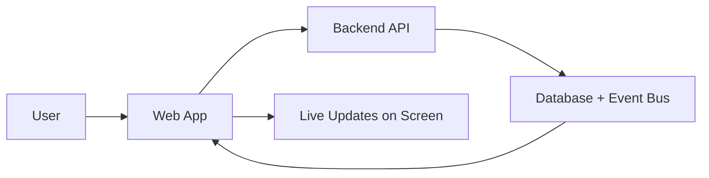

### 1-minute summary

NANFO is a web app for network operations teams.  
You sign in, choose your organization and workspace, then manage operations from one place.  
You can:
- Watch live telemetry (live measurements).
- See topology (how devices connect).
- Run simulations before making real changes.
- Validate and execute intents (planned actions).
- Handle alerts.
- Manage plugins.
- Generate reports.

### 5-minute summary

NANFO helps people run network operations with less risk.

- **Monitoring:** You can see health and measurements in near real time.
- **Topology visibility:** You can see devices and their relationships.
- **Simulation:** You can test a change before applying it.
- **Intent execution:** You can validate a planned action, then run it safely.
- **Alerts:** You can acknowledge and resolve operational alerts.
- **Plugins:** You can install and manage extension plugins with safety checks.
- **Reporting:** You can create report jobs and read report results.

### Who should use NANFO

- Network operations teams.
- Reliability and support teams.
- QA testers validating operations workflows.

### Core outcomes table

| Outcome | What it means in plain English | Where you do it |
|---|---|---|
| Monitoring | See live and historical measurements | `Telemetry`, `Reliability` |
| Topology visibility | See which devices exist and how they connect | `Topology Analysis`, `Digital Twin` |
| Simulation safety | Test before real changes | `Simulation` |
| Intent execution | Plan and run controlled changes | `Intent` |
| Alert handling | Track and resolve operational problems | `Reliability` |
| Plugin control | Add and manage safe extensions | `Plugins` |
| Reporting | Create executive and technical reports | `Reports` |

---

<a id="section-2"></a>
## 2) Big Picture Flow (Beginner Friendly)

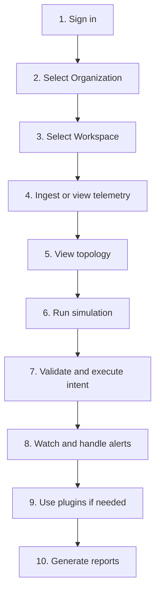

### Simple journey in words

1. Sign in with your operator account.
2. Select your organization.
3. Select your workspace.
4. Make sure network and device data exists.
5. Watch telemetry and topology.
6. Run a simulation.
7. Validate an intent, then execute it.
8. Handle alerts.
9. Use plugins if your team needs extension features.
10. Generate reports.

### Dependency chain (A before B)

| Step A (must be done first) | Step B (depends on A) | Why this matters |
|---|---|---|
| Authentication | Any protected page under `/ops/*` | Without sign-in, app redirects to login |
| Organization | Workspace | Workspaces belong to organizations |
| Workspace | Network creation | Networks are scoped to a workspace |
| Network | Device creation | Devices belong to a network |
| Network + devices | Useful topology and digital twin views | No devices means empty topology |
| Telemetry data | Useful alerts and trend visibility | No telemetry means little signal |
| Simulation run | Strong intent risk confidence | Intent workflows use simulation/risk context |
| Intent validation | Intent execute | Execute should follow a valid plan |

### Simplified timeline visual

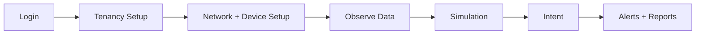

---

<a id="section-3"></a>
## 3) Prerequisites and Dependencies (Complete)

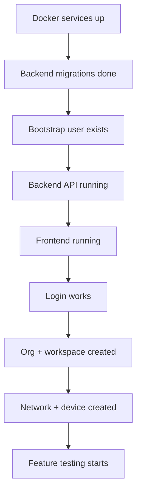

### System prerequisites

| Item | Why you need it | Quick check | If missing |
|---|---|---|---|
| Docker | Runs PostgreSQL, Neo4j, Redis | `docker --version` | Backend cannot start fully |
| Python 3.12+ | Runs backend | `python --version` | Backend commands fail |
| Poetry | Backend dependency manager | `poetry --version` | Cannot install or run backend tools |
| Node.js 20+ and npm | Runs frontend | `node --version`, `npm --version` | Frontend cannot run |

### Backend dependencies

| Backend dependency | Used for | What happens if missing |
|---|---|---|
| PostgreSQL | Main relational data | API errors on CRUD operations |
| Neo4j | Topology graph queries | Topology views are empty or fail |
| Redis | Event bus, login sessions and rate limits, websocket support | Realtime/event behavior breaks; since ADR-028, authenticated requests return 503 until Redis is back |

### Frontend dependencies

| Frontend dependency | Used for | What happens if missing |
|---|---|---|
| `frontend/.env` API URL | REST calls | UI cannot load API data |
| `frontend/.env` WS URL | Live websocket updates | Realtime tiles show disconnected |
| Valid auth token | Protected routes | Redirect to login |

### External service and connectivity assumptions

| Assumption | Expected value |
|---|---|
| Backend base URL | `http://127.0.0.1:8000` |
| Frontend URL | `http://127.0.0.1:5173` |
| CORS origin allowed | `http://localhost:5173` and `http://127.0.0.1:5173` |
| Websocket base URL | `ws://127.0.0.1:8000` |

### Data and setup prerequisites

Checklist:
- [ ] Infrastructure started (`./scripts/dev-start.sh`).
- [ ] Backend `.env` exists.
- [ ] Migrations done (`alembic upgrade head`).
- [ ] Bootstrap user created (for example `admin@example.com / admin123`).
- [ ] Backend running on port `8000`.
- [ ] Frontend running on port `5173`.

### Important dependency rules

- Authentication must work before any protected page can be used.
- Telemetry data is needed before topology/alerts feel meaningful.
- Simulation output depends on available topology/runtime state.
- Intent execute depends on validate and permission checks.

### Current sprint caution (VS21 context)

Known high-risk open items from current sprint tracking:
- Tenant/RBAC enforcement consistency across all route families is not fully closed.
- Simulation terminal producer parity for `simulation.completed` and `simulation.cancelled` is still open.

What this means for users/testers:
- Use full testing order with stop/go gates.
- Treat authorization edge failures as important findings.

---

<a id="section-4"></a>
## 4) UI Navigation Map (Everything a User Clicks)

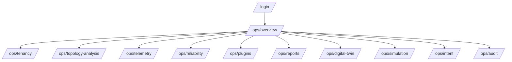

### Navigation notes

- Public route: `/login`.
- Protected area: all `/ops/*` routes.
- If not signed in, app redirects to login.
- Left menu and command palette are available after login.

### Page-by-page guide

#### Login (`/login`)

- **Purpose:** Sign in to access the app.
- **Visible sections:** Login form and error message area.

| Control | Type | What it does | Example value |
|---|---|---|---|
| Email | Input | Account email | `admin@example.com` |
| Password | Input | Account password | `admin123` |
| Sign In | Button | Sends login request and loads profile | Click once |

| Common mistake | Fix |
|---|---|
| Wrong password | Re-enter password and try again |
| User not bootstrapped | Create bootstrap user first |

- **Success result:** You go to `/ops/overview`.
- **Failure result:** "Login failed" message appears.

[Insert Screenshot: Login page with callouts 1-3]  
Callouts:  
1) Email field  
2) Password field  
3) Sign In button

#### Overview (`/ops/overview`)

- **Purpose:** Quick operations dashboard for context, network, and device setup.
- **Visible sections:** WS status tiles, organization/workspace selectors, workspace capacity, networks, devices.

| Control | Type | What it does | Example |
|---|---|---|---|
| Organization selector | Dropdown | Sets active organization | Pick your org |
| Workspace selector | Dropdown | Sets active workspace | Pick your workspace |
| Create Network | Button | Creates network in current workspace | `Network-1234` auto-generated |
| Add Device | Button | Creates device in selected network | `sw-1234` auto-generated |
| Spatial ref input | Input | Edits device location text | `campus-a/building-1/floor-2/rack-4` |
| Save (spatial) | Button | Saves `spatial_ref_id` | Click after edit |

| Common mistake | Fix |
|---|---|
| No workspace selected | Go to Tenancy and select/create workspace |
| No network selected when adding device | Select network first |

- **Success result:** New network/device appears in list.
- **Failure result:** Toast error explains the issue.

[Insert Screenshot: Overview page with callouts 1-6]  
Callouts:  
1) WS status tiles  
2) Organization selector  
3) Workspace selector  
4) Create Network button  
5) Add Device button  
6) Spatial ref Save action

#### Tenancy (`/ops/tenancy`)

- **Purpose:** Manage organizations, workspaces, and org members.
- **Visible sections:** Organization Scope, Workspaces, Organization Members.

| Control | Type | What it does | Example |
|---|---|---|---|
| Organization Name | Input | New organization display name | `North America NOC` |
| Slug | Input | URL-safe short name | `north-america-noc` |
| Create Organization | Button | Creates organization | Click once |
| Workspace Name | Input | New workspace name | `Production` |
| Description | Input | Optional workspace note | `Primary operations workspace` |
| Create Workspace | Button | Creates workspace in current org | Click once |
| User ID (UUID) | Input | User to add to org | `00000000-0000-0000-0000-000000000000` |
| Role | Dropdown | Member role | `Operator` |
| Add Member | Button | Adds org member | Click once |
| Remove | Button | Removes member (not current session user) | Click row action |

| Common mistake | Fix |
|---|---|
| Invalid slug format | Use lowercase letters, numbers, dashes |
| Invalid UUID in member field | Paste correct user UUID |

- **Success result:** Created org/workspace/member appears in list.
- **Failure result:** Form-level error or toast appears.

[Insert Screenshot: Tenancy page with callouts 1-8]  
Callouts:  
1) Organization Name  
2) Slug  
3) Create Organization  
4) Workspace Name  
5) Create Workspace  
6) User ID field  
7) Role selector  
8) Add Member

#### Topology Analysis (`/ops/topology-analysis`)

- **Purpose:** Analyze neighbors, impact, and run reconcile.
- **Visible sections:** Top controls, Neighbours tab, Impact tab.

| Control | Type | What it does | Example |
|---|---|---|---|
| Device | Dropdown | Selects focus device | `edge-sw-01` |
| Neighbour depth | Number input | How far to search neighbors | `2` |
| Impact max hops | Number input | How far to calculate impact | `3` |
| Run Reconcile | Button | Re-checks topology state | Click once |
| Neighbours tab | Button | Shows neighbor results | Click |
| Impact tab | Button | Shows impact results | Click |

| Common mistake | Fix |
|---|---|
| No devices in topology | Create network/device first |
| Invalid depth/hops | Keep within shown min/max |

- **Success result:** Results cards and summaries are shown.
- **Failure result:** Reconcile failed error state appears.

[Insert Screenshot: Topology Analysis page with callouts 1-6]  
Callouts: Device selector, depth, max hops, Run Reconcile, Neighbours tab, Impact tab.

#### Telemetry (`/ops/telemetry`)

- **Purpose:** View health, history, and live metrics.
- **Visible sections:** Telemetry Health, Telemetry History, Device Drilldown, Realtime Metrics.

| Control | Type | What it does | Example |
|---|---|---|---|
| metric filter | Input | Filters history by metric name | `cpu_usage` |
| History row click | Row action | Selects device for drilldown | Click one row |
| Device selector | Dropdown | Chooses device history | Pick one device |

| Common mistake | Fix |
|---|---|
| No data in history | Make sure telemetry ingestion is running |
| No devices in drilldown | Add devices from Overview |

- **Success result:** History rows and live metric cards show values.
- **Failure result:** Empty-state message appears.

[Insert Screenshot: Telemetry page with callouts 1-4]  
Callouts: Health panel, metric filter, history list, live metrics panel.

#### Reliability (`/ops/reliability`)

- **Purpose:** View and handle alerts.
- **Visible sections:** Runtime Reliability, Source Breakdown, Alerts Lifecycle.

| Control | Type | What it does | Example |
|---|---|---|---|
| Search | Input | Filters by key/source/correlation | `telemetry` |
| Status filters | Buttons | Filter All/Active/Ack/Resolved | Click `Active` |
| Acknowledge | Button | Marks alert acknowledged | Per row |
| Resolve | Button | Marks alert resolved | Per row |

| Common mistake | Fix |
|---|---|
| Trying to ack resolved alert | Use current status, then resolve only when needed |
| No alerts listed | Confirm telemetry or alert events exist |

- **Success result:** Alert state changes and queue status toasts appear.
- **Failure result:** Action failed error is shown.

[Insert Screenshot: Reliability page with callouts 1-5]  
Callouts: Search, status filters, alert status badge, Acknowledge, Resolve.

#### Plugins (`/ops/plugins`)

- **Purpose:** Install and manage plugins with safety checks.
- **Visible sections:** Plugin Runtime Safety form, Plugin Registry.

| Control | Type | What it does | Example |
|---|---|---|---|
| Plugin Key | Input | Plugin identifier | `safe-plugin` |
| Name | Input | Plugin display name | `Safe Plugin` |
| Version | Input | Plugin version | `1.0.0` |
| Signer | Input | Signer name | `nanfo-labs` |
| Signature | Input | Signature value | `sig:abcdef123` |
| Dependencies | Input | Required platform components | `core:telemetry` |
| Sandbox Permissions | Input | Requested permissions | `read:telemetry, read:topology` |
| Install Plugin | Button | Installs plugin record | Click once |
| Enable | Button | Enables plugin if safe | Per row |
| Disable | Button | Disables plugin | Per row |

| Common mistake | Fix |
|---|---|
| Signature/dependency/sandbox not valid | Fix fields until safety badges become compatible |
| Plugin cannot enable | Read safety warning text and retry |

- **Success result:** Plugin status and badges update.
- **Failure result:** Safety-block or error toast appears.

[Insert Screenshot: Plugins page with callouts 1-10]  
Callouts: form fields, Install button, safety badges, Enable/Disable buttons.

#### Reports (`/ops/reports`)

- **Purpose:** Request reports and track status/artifacts.
- **Visible sections:** Report Generator, Report Status.

| Control | Type | What it does | Example |
|---|---|---|---|
| Report Type | Input | Report category | `executive_summary` |
| Output Format | Dropdown | `pdf` or `csv` | `pdf` |
| Date Range Start | Input | Start timestamp | `2026-08-01T00:00:00Z` |
| Date Range End | Input | End timestamp | `2026-08-14T00:00:00Z` |
| Scope JSON | Textarea | Scope object | `{"workspace":"all"}` |
| Filters JSON | Textarea | Filter object | `{"kpi":"latency"}` |
| Idempotency Key | Input | Unique request key | `report-123abc` |
| Generate Report | Button | Starts async report job | Click once |
| Retry Failed Report | Button | Re-run failed request with new key | Click when shown |

| Common mistake | Fix |
|---|---|
| Invalid JSON | Use valid JSON object format |
| Start date after end date | Correct date order |

- **Success result:** Status changes and artifact list appears.
- **Failure result:** Failure diagnostics and retry action appear.

[Insert Screenshot: Reports page with callouts 1-9]  
Callouts: all main form fields, Generate button, Status badges, Retry action.

#### Digital Twin (`/ops/digital-twin`)

- **Purpose:** 3D scene and node inspection with live scene deltas.
- **Visible sections:** 3D Digital Twin, Inspector, Live Scene Deltas.

| Control | Type | What it does | Example |
|---|---|---|---|
| Inspect Node | Dropdown | Loads node detail and neighbors | Pick one node |
| 3D scene click | Scene action | Selects a node in scene | Click node |

| Common mistake | Fix |
|---|---|
| Empty scene | Add devices and ensure topology events are flowing |
| No live deltas | Run simulation or intent actions |

- **Success result:** Inspector and delta cards update.
- **Failure result:** Empty-state text remains.

[Insert Screenshot: Digital Twin page with callouts 1-4]  
Callouts: 3D scene, inspect dropdown, inspector panel, live deltas panel.

#### Simulation (`/ops/simulation`)

- **Purpose:** Start, pause, branch, and compare simulation runs.
- **Visible sections:** Simulation Lifecycle, Simulation Detail, Compare, Realtime Simulation Timeline.

| Control | Type | What it does | Example |
|---|---|---|---|
| Scenario Name | Input | Name for simulation | `Campus baseline validation` |
| Start Simulation | Button | Starts a run | Click once |
| Pause | Button | Pauses tracked simulation | Click if running |
| Branch | Button | Creates child simulation | Click with branch name |
| Branch scenario name | Input | Name for branch | `Branch candidate` |
| Simulation ID | Input | Manual tracked run id | Paste UUID |
| Baseline simulation ID | Input | Compare baseline id | Paste UUID |

| Common mistake | Fix |
|---|---|
| No network selected | Select a network first |
| Compare ids missing | Fill both simulation IDs |

- **Success result:** Status badges and compare metrics update.
- **Failure result:** Error cards show action failure.

[Insert Screenshot: Simulation page with callouts 1-7]  
Callouts: Scenario name, Start, Pause, Branch, branch name, simulation ID, baseline ID.

#### Intent (`/ops/intent`)

- **Purpose:** Validate and execute intent with explainability/confidence.
- **Visible sections:** Validate and Execute form, Intent Detail, Realtime Intent Deltas.

| Control | Type | What it does | Example |
|---|---|---|---|
| Action | Dropdown | Intent action type | `reroute_path` |
| Idempotency Key | Input | Conflict-safe execution key | `intent-123abc` |
| Scope JSON | Textarea | Target object | `{"building":"A","segment":"core"}` |
| Constraints JSON | Textarea | Limits and rules | `{"max_downtime":0}` |
| Validate | Button | Validates intent | Click once |
| Execute | Button | Executes validated intent | Click when enabled |
| Intent ID | Input | Manual intent lookup id | Paste UUID |

| Common mistake | Fix |
|---|---|
| Invalid JSON | Use valid object JSON |
| Execute disabled | Validate first or check permissions |

- **Success result:** Lifecycle badges and timeline update.
- **Failure result:** Validation or execution error state appears.

[Insert Screenshot: Intent page with callouts 1-7]  
Callouts: Action, idempotency key, Scope JSON, Constraints JSON, Validate, Execute, Intent ID.

#### Audit (`/ops/audit`)

- **Purpose:** Review audit event history.
- **Visible sections:** Audit Timeline list and filter box.

| Control | Type | What it does | Example |
|---|---|---|---|
| Filter input | Input | Filter by event/resource/correlation | `intent.execution_completed` |

| Common mistake | Fix |
|---|---|
| No logs shown | Remove filter or run actions to create new logs |

- **Success result:** Matching logs stay in list.
- **Failure result:** Empty-state message if no items match.

[Insert Screenshot: Audit page with callouts 1-2]  
Callouts: filter input, virtualized timeline list.

---

<a id="section-5"></a>
## 5) Detailed Feature Playbooks (Step-by-Step)

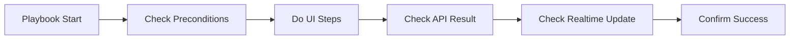

### Playbook 1: Authentication / Login

- **Preconditions:** Backend and frontend are running. Bootstrap user exists.
- **UI path:** `Login page`.

Steps:
1. Open `http://127.0.0.1:5173`.
2. Enter email, for example `admin@example.com`.
3. Enter password, for example `admin123`.
4. Click `Sign In`.

Expected backend behavior:
- `POST /api/v1/auth/login` returns tokens.
- `GET /api/v1/auth/me` returns user profile.

Expected realtime behavior:
- Realtime sockets start after login and context selection.

Success checks:
- You are redirected to `/ops/overview`.
- User id appears in header area.

Rollback/cancel:
- Click `Logout` to clear session.

[Insert Screenshot Sequence: Login step 1-4 with callouts]

### Playbook 2: Organization and Workspace Management

- **Preconditions:** Logged in.
- **UI path:** `Overview -> Tenancy`.

Steps:
1. Open `Tenancy` page.
2. In `Organization Name`, type `North America NOC`.
3. In `Slug`, type `north-america-noc`.
4. Click `Create Organization`.
5. In `Workspace Name`, type `Production`.
6. Optional: in Description, type `Primary operations workspace`.
7. Click `Create Workspace`.
8. Optional: add member using UUID and role.

Expected backend behavior:
- `POST /api/v1/organizations` -> `201`.
- `POST /api/v1/organizations/{org_id}/workspaces` -> `201`.
- `POST /api/v1/organizations/{org_id}/members` -> `201`.

Expected realtime behavior:
- None required for tenancy.

Success checks:
- New organization appears in selector.
- New workspace appears and can be selected.

Rollback/cancel:
- Remove member with `Remove` button.
- Admin/API cleanup can delete org/workspace if needed.

[Insert Screenshot Sequence: Tenancy create org/workspace/member with callouts]

### Playbook 3: Telemetry Monitoring

- **Preconditions:** Logged in, workspace selected, network and devices exist.
- **UI path:** `Overview -> Telemetry`.

Steps:
1. Go to `Telemetry` page.
2. Check `Telemetry Health` tiles.
3. In metric filter, type `cpu_usage`.
4. Click a history row.
5. Use `Device Drilldown` selector.
6. Watch `Realtime Metrics` cards.

Expected backend behavior:
- `GET /api/v1/telemetry/health`.
- `GET /api/v1/telemetry/history`.
- `GET /api/v1/telemetry/device/{device_id}`.

Expected realtime behavior:
- `/ws/telemetry` frames update live cards.

Success checks:
- Health is visible.
- History rows load.
- Live metrics change over time.

Rollback/cancel:
- Clear filter input to return to full list.

[Insert Screenshot Sequence: Telemetry health/history/live with callouts]

### Playbook 4: Topology Analysis

- **Preconditions:** Network and devices exist.
- **UI path:** `Overview -> Topology Analysis`.

Steps:
1. Open `Topology Analysis`.
2. Select a device.
3. Set neighbor depth (for example `2`).
4. Set impact max hops (for example `3`).
5. Click `Run Reconcile`.
6. Review `Neighbours` tab.
7. Review `Impact` tab.

Expected backend behavior:
- `GET /api/v1/topology/graph`.
- `GET /api/v1/topology/device/{id}/neighbors`.
- `GET /api/v1/topology/impact/{id}`.
- `POST /api/v1/topology/reconcile`.

Expected realtime behavior:
- `/ws/topology` deltas may refresh analysis results.

Success checks:
- Neighbor and impact rows appear.
- Reconcile status cards show counts.

Rollback/cancel:
- No destructive action in this page by default.

[Insert Screenshot Sequence: Topology controls + neighbors + impact]

### Playbook 5: Simulation Lifecycle

- **Preconditions:** Network selected.
- **UI path:** `Overview -> Simulation`.

Steps:
1. Enter scenario name, for example `Campus baseline validation`.
2. Click `Start Simulation`.
3. Copy/save returned simulation id.
4. Click `Pause` (optional).
5. Enter branch scenario name `Branch candidate` and click `Branch` (optional).
6. Enter baseline id and tracked id for compare.
7. Review compare delta metrics.

Expected backend behavior:
- `POST /api/v1/simulations/start`.
- `POST /api/v1/simulations/pause`.
- `POST /api/v1/simulations/branch`.
- `GET /api/v1/simulations/{id}`.
- `GET /api/v1/simulations/{id}/compare/{baselineId}`.

Expected realtime behavior:
- `/ws/digital-twin` scene deltas show simulation states.

Success checks:
- Detail panel shows status and validation data.
- Compare panel shows numeric deltas.

Rollback/cancel:
- Pause active run.
- Branch instead of modifying current run.

[Insert Screenshot Sequence: Start -> Detail -> Compare -> Realtime timeline]

### Playbook 6: Intent Validation / Execution

- **Preconditions:** Workspace and network selected.
- **UI path:** `Overview -> Intent`.

Steps:
1. Pick action, for example `reroute_path`.
2. Set idempotency key (for example `intent-20260816-1`).
3. Enter Scope JSON (for example `{"building":"A","segment":"core"}`).
4. Enter Constraints JSON (for example `{"max_downtime":0}`).
5. Click `Validate`.
6. Confirm intent id appears.
7. Click `Execute`.
8. Watch detail timeline and realtime panel.

Expected backend behavior:
- `POST /api/v1/intents/validate`.
- `POST /api/v1/intents/execute`.
- `GET /api/v1/intents/{id}`.

Expected realtime behavior:
- `/ws/digital-twin` shows `intent.*` lifecycle scene updates.

Success checks:
- Status moves through lifecycle states.
- Confidence and explainability text appears.

Rollback/cancel:
- Use a new idempotency key to avoid replay conflict.
- Stop at validate stage if execution should not proceed.

[Insert Screenshot Sequence: Validate form -> Execute -> Lifecycle timeline]

### Playbook 7: Alerts Acknowledge / Resolve

- **Preconditions:** Alerts exist.
- **UI path:** `Overview -> Reliability`.

Steps:
1. Open `Reliability` page.
2. Filter status to `Active`.
3. Pick one alert.
4. Click `Acknowledge`.
5. Click `Resolve` when ready.

Expected backend behavior:
- `GET /api/v1/alerts`.
- `POST /api/v1/alerts/{id}/ack`.
- `POST /api/v1/alerts/{id}/resolve`.

Expected realtime behavior:
- `/ws/alerts` updates alert state cards.

Success checks:
- Alert badge moves to `acknowledged` then `resolved`.

Rollback/cancel:
- None after resolve; state is terminal for that alert.

[Insert Screenshot Sequence: Alert row -> Acknowledge -> Resolve]

### Playbook 8: Plugins Install / Enable / Disable

- **Preconditions:** Logged in with permission.
- **UI path:** `Overview -> Plugins`.

Steps:
1. Fill plugin form:
   - Key `safe-plugin`
   - Name `Safe Plugin`
   - Version `1.0.0`
   - Signer `nanfo-labs`
   - Signature `sig:abcdef1234567890`
   - Dependencies `core:telemetry`
   - Permissions `read:telemetry, read:topology`
2. Click `Install Plugin`.
3. In registry row, review safety badges.
4. Click `Enable` if safety checks pass.
5. Click `Disable` to turn it off.

Expected backend behavior:
- `POST /api/v1/plugins/install`.
- `POST /api/v1/plugins/{id}/enable`.
- `POST /api/v1/plugins/{id}/disable`.
- `GET /api/v1/plugins` polling refresh.

Expected realtime behavior:
- No websocket channel required for plugins in this slice.

Success checks:
- Plugin status and enabled badge change correctly.

Rollback/cancel:
- Use `Disable` to revert enabled state.

[Insert Screenshot Sequence: Plugin form -> Registry safety badges -> Enable/Disable]

### Playbook 9: Reports Generate / View

- **Preconditions:** Workspace selected.
- **UI path:** `Overview -> Reports`.

Steps:
1. Set report type `executive_summary`.
2. Set format `pdf`.
3. Set date range start and end.
4. Enter Scope JSON and Filters JSON.
5. Set idempotency key.
6. Click `Generate Report`.
7. Watch status until terminal.
8. Review artifact list.

Expected backend behavior:
- `POST /api/v1/reports/generate`.
- `GET /api/v1/reports/{id}` polling.

Expected realtime behavior:
- No websocket channel required for reports in this slice.

Success checks:
- Status reaches terminal state.
- Artifacts list appears (or failure diagnostics appears with retry button).

Rollback/cancel:
- Retry failed report with regenerated idempotency key.

[Insert Screenshot Sequence: Report form -> Status badges -> Artifacts]

---

<a id="section-6"></a>
## 6) Full Testing Guide (Correct Order, End-to-End)

### Test execution rules

- Run tests in order from smoke to performance.
- Respect stop/go gates.
- If a blocker test fails, fix first, then retest that block.
- For transient flaky tests, run one immediate rerun before opening a defect.

### Test block order

1. Smoke tests (fast confidence)
2. Functional tests (feature-by-feature)
3. Integration journey tests (cross-feature)
4. Realtime tests (websocket and reconnect)
5. Negative tests (bad input and permissions)
6. Accessibility checks
7. Performance and stability checks

---

### 6.1 Smoke tests

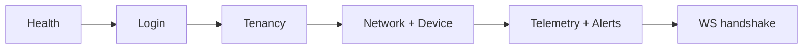

#### SMK-01
- **Test ID:** `SMK-01`
- **Purpose:** Confirm backend is alive.
- **Preconditions:** Backend process running.
- **Steps:**
  1. Run `curl http://127.0.0.1:8000/health`.
- **Input examples:** none.
- **Expected result:** `200` and `{ "status": "ok" }`.
- **Failure clues:** Connection refused or non-200.
- **Recovery action:** Start backend and infrastructure services.
- **Pass/Fail checklist:**
  - [ ] Pass if `200` and `status=ok`.
  - [ ] Fail if any other response.

#### SMK-02
- **Test ID:** `SMK-02`
- **Purpose:** Confirm login works.
- **Preconditions:** Bootstrap user exists.
- **Steps:**
  1. Open login page.
  2. Sign in with valid credentials.
- **Input examples:** `admin@example.com` / `admin123`.
- **Expected result:** Redirect to `/ops/overview`.
- **Failure clues:** Login failed message.
- **Recovery action:** Recreate bootstrap user, verify password.
- **Pass/Fail checklist:**
  - [ ] Pass if redirect and session active.
  - [ ] Fail if user stays on login with error.

#### SMK-03
- **Test ID:** `SMK-03`
- **Purpose:** Confirm tenancy create path works.
- **Preconditions:** Logged in.
- **Steps:**
  1. Create organization.
  2. Create workspace.
- **Input examples:** `North America NOC`, `north-america-noc`, `Production`.
- **Expected result:** New org/workspace appears.
- **Failure clues:** 422/409 validation or conflict errors.
- **Recovery action:** Correct slug/fields, use unique slug.
- **Pass/Fail checklist:**
  - [ ] Pass if both create actions succeed.
  - [ ] Fail if either create action fails.

#### SMK-04
- **Test ID:** `SMK-04`
- **Purpose:** Confirm network and device baseline works.
- **Preconditions:** Workspace selected.
- **Steps:**
  1. Click `Create Network`.
  2. Select network.
  3. Click `Add Device`.
- **Input examples:** default generated values are acceptable.
- **Expected result:** Network and device rows appear.
- **Failure clues:** API 4xx/5xx, row not visible.
- **Recovery action:** Ensure workspace and network are selected.
- **Pass/Fail checklist:**
  - [ ] Pass if network and device are created and listed.
  - [ ] Fail if missing rows after refresh.

#### SMK-05
- **Test ID:** `SMK-05`
- **Purpose:** Confirm telemetry and alerts pages load.
- **Preconditions:** Logged in.
- **Steps:**
  1. Open `Telemetry`.
  2. Open `Reliability`.
- **Input examples:** none.
- **Expected result:** No crash, panels render, queries complete.
- **Failure clues:** Error states on first load.
- **Recovery action:** Check backend logs and auth token.
- **Pass/Fail checklist:**
  - [ ] Pass if both pages render with valid query state.
  - [ ] Fail on repeated API errors.

#### SMK-06
- **Test ID:** `SMK-06`
- **Purpose:** Confirm websocket handshakes work.
- **Preconditions:** Login + network selected.
- **Steps:**
  1. Run `poetry run python scripts/run_local_flow_check.py --report-path /tmp/opencode/nanfo-flow-report.json` from `backend/`.
  2. Review websocket steps in output.
- **Input examples:** default script args.
- **Expected result:** `ws-alerts-subscribe`, `ws-topology-subscribe`, `ws-telemetry-subscribe`, `ws-digital-twin-subscribe` all pass.
- **Failure clues:** Timeout waiting subscribe ack.
- **Recovery action:** Restart backend; verify token and network context.
- **Pass/Fail checklist:**
  - [ ] Pass if all websocket checks pass.
  - [ ] Fail if any websocket step fails.

---

### 6.2 Functional tests

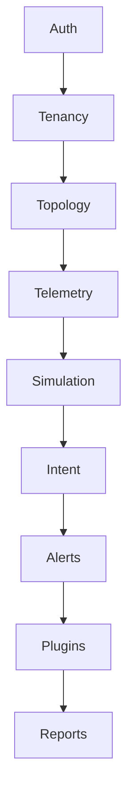

#### FNC-01
- **Test ID:** `FNC-01`
- **Purpose:** Validate auth lifecycle (`login`, `me`, `logout`).
- **Preconditions:** Valid user exists.
- **Steps:** Login, open app, logout.
- **Input examples:** valid email/password.
- **Expected result:** Session starts and clears correctly.
- **Failure clues:** Cannot fetch profile after login.
- **Recovery action:** Check `/auth/me` response and token storage.
- **Pass/Fail checklist:**
  - [ ] Pass if login+profile+logout all succeed.

#### FNC-02
- **Test ID:** `FNC-02`
- **Purpose:** Validate org/workspace/member management.
- **Preconditions:** Logged in.
- **Steps:** Create org, create workspace, add member, list members.
- **Input examples:** example values from Tenancy section.
- **Expected result:** Lists show created records.
- **Failure clues:** duplicate slug, invalid UUID.
- **Recovery action:** use unique slug and valid UUID.
- **Pass/Fail checklist:**
  - [ ] Pass if create/list/member actions succeed.

#### FNC-03
- **Test ID:** `FNC-03`
- **Purpose:** Validate network/device create and spatial ref edit.
- **Preconditions:** Workspace selected.
- **Steps:** Create network, add device, edit spatial ref, save.
- **Input examples:** `campus-a/building-1/floor-2/rack-4`.
- **Expected result:** Device row updates with new spatial ref.
- **Failure clues:** save toast shows error.
- **Recovery action:** verify network selected and API status.
- **Pass/Fail checklist:**
  - [ ] Pass if create and update flows persist.

#### FNC-04
- **Test ID:** `FNC-04`
- **Purpose:** Validate topology neighbors/impact/reconcile.
- **Preconditions:** At least one device exists.
- **Steps:** Select device, set depth/hops, run reconcile, inspect tabs.
- **Input examples:** depth `2`, hops `3`.
- **Expected result:** neighbor and impact entries returned.
- **Failure clues:** empty due to missing topology data.
- **Recovery action:** create more devices and retry.
- **Pass/Fail checklist:**
  - [ ] Pass if reconcile and analysis data appear.

#### FNC-05
- **Test ID:** `FNC-05`
- **Purpose:** Validate telemetry page behavior.
- **Preconditions:** Telemetry pipeline active.
- **Steps:** Open page, filter metric, select device.
- **Input examples:** `cpu_usage`.
- **Expected result:** health + history + drilldown load.
- **Failure clues:** all states empty for long time.
- **Recovery action:** verify telemetry ingestion and service health.
- **Pass/Fail checklist:**
  - [ ] Pass if telemetry queries return data or valid empty states.

#### FNC-06
- **Test ID:** `FNC-06`
- **Purpose:** Validate simulation lifecycle UI and API.
- **Preconditions:** Network selected.
- **Steps:** Start simulation, view detail, branch, compare.
- **Input examples:** scenario names from playbook.
- **Expected result:** simulation detail and compare metrics visible.
- **Failure clues:** start returns 4xx/5xx.
- **Recovery action:** re-check network context and retry.
- **Pass/Fail checklist:**
  - [ ] Pass if start/detail/compare work.

#### FNC-07
- **Test ID:** `FNC-07`
- **Purpose:** Validate intent validate+execute lifecycle.
- **Preconditions:** Workspace and network selected.
- **Steps:** Validate JSON intent, execute, view detail.
- **Input examples:** `{"building":"A","segment":"core"}`.
- **Expected result:** lifecycle statuses move forward.
- **Failure clues:** idempotency conflict or execute denied.
- **Recovery action:** new key or correct permissions.
- **Pass/Fail checklist:**
  - [ ] Pass if validate and execute both succeed.

#### FNC-08
- **Test ID:** `FNC-08`
- **Purpose:** Validate alerts list/ack/resolve.
- **Preconditions:** At least one alert exists.
- **Steps:** Filter active, acknowledge alert, resolve alert.
- **Input examples:** search `telemetry`.
- **Expected result:** status transitions shown in UI.
- **Failure clues:** action buttons disabled unexpectedly.
- **Recovery action:** refresh list and verify current status.
- **Pass/Fail checklist:**
  - [ ] Pass if alert state transitions complete.

#### FNC-09
- **Test ID:** `FNC-09`
- **Purpose:** Validate plugin and report features.
- **Preconditions:** Logged in.
- **Steps:** Install plugin, enable/disable, generate report, check report status.
- **Input examples:** plugin/report examples from playbooks.
- **Expected result:** plugin lifecycle and report lifecycle both work.
- **Failure clues:** plugin safety block or report validation error.
- **Recovery action:** fix input values and retry.
- **Pass/Fail checklist:**
  - [ ] Pass if plugin and report flows complete with expected statuses.

---

### 6.3 Integration journey tests

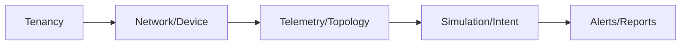

#### INT-01
- **Test ID:** `INT-01`
- **Purpose:** Validate full setup journey from login to device creation.
- **Preconditions:** Fresh local environment.
- **Steps:** Login -> create org/workspace -> create network/device.
- **Input examples:** values from sections 4 and 5.
- **Expected result:** All created IDs are valid and listable.
- **Failure clues:** one resource exists but next level cannot be created.
- **Recovery action:** verify parent resource selection.
- **Pass/Fail checklist:**
  - [ ] Pass if each child resource links to parent correctly.

#### INT-02
- **Test ID:** `INT-02`
- **Purpose:** Validate data-to-decision journey.
- **Preconditions:** Device exists, telemetry available.
- **Steps:** Observe telemetry -> run topology analysis -> run simulation.
- **Input examples:** metric filter `cpu_usage`, depth `2`.
- **Expected result:** all three pages show coherent data.
- **Failure clues:** topology empty while device exists for long period.
- **Recovery action:** run reconcile and retry after short wait.
- **Pass/Fail checklist:**
  - [ ] Pass if data is visible across all pages.

#### INT-03
- **Test ID:** `INT-03`
- **Purpose:** Validate action-to-observability journey.
- **Preconditions:** Validated intent ready.
- **Steps:** Execute intent -> monitor alerts -> generate report -> check audit timeline.
- **Input examples:** intent action `reroute_path`, report type `executive_summary`.
- **Expected result:** intent state updates, alerts/report/audit surfaces reflect actions.
- **Failure clues:** missing lifecycle updates in dependent pages.
- **Recovery action:** verify websocket status and retry reads.
- **Pass/Fail checklist:**
  - [ ] Pass if action effects are visible across multiple features.

---

### 6.4 Realtime tests

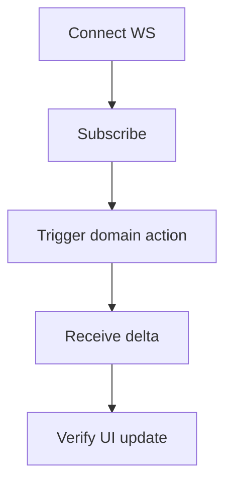

#### RT-01
- **Test ID:** `RT-01`
- **Purpose:** Validate `/ws/topology` updates.
- **Preconditions:** Network selected.
- **Steps:** Open Overview and Topology page, add device, watch topology status/result refresh.
- **Input examples:** default generated device.
- **Expected result:** topology websocket is open and topology updates reflect new device.
- **Failure clues:** websocket disconnected or no update.
- **Recovery action:** restart backend and reconnect.
- **Pass/Fail checklist:**
  - [ ] Pass if topology state updates after device action.

#### RT-02
- **Test ID:** `RT-02`
- **Purpose:** Validate `/ws/telemetry` updates.
- **Preconditions:** Telemetry events are flowing.
- **Steps:** Open Telemetry page, watch `Realtime Metrics` panel.
- **Input examples:** none.
- **Expected result:** new live metric cards appear.
- **Failure clues:** long wait with no deltas and disconnected tile.
- **Recovery action:** check telemetry producer/consumer and websocket status.
- **Pass/Fail checklist:**
  - [ ] Pass if live metrics change without page reload.

#### RT-03
- **Test ID:** `RT-03`
- **Purpose:** Validate `/ws/alerts` updates.
- **Preconditions:** Alert events are generated.
- **Steps:** Keep Reliability page open during alert lifecycle events.
- **Input examples:** ack/resolve one alert.
- **Expected result:** status updates appear live.
- **Failure clues:** only appears after manual refresh.
- **Recovery action:** check websocket status and event pipeline.
- **Pass/Fail checklist:**
  - [ ] Pass if statuses update in near real time.

#### RT-04
- **Test ID:** `RT-04`
- **Purpose:** Validate `/ws/digital-twin` updates for simulation/intent.
- **Preconditions:** run simulation or intent.
- **Steps:** Start simulation and execute intent, keep Digital Twin or Intent page open.
- **Input examples:** default simulation + `reroute_path` intent.
- **Expected result:** scene delta cards update with lifecycle state.
- **Failure clues:** no scene object updates.
- **Recovery action:** verify network context and websocket token.
- **Pass/Fail checklist:**
  - [ ] Pass if scene deltas show state transitions.

#### RT-05
- **Test ID:** `RT-05`
- **Purpose:** Validate reconnect and unauthorized handling.
- **Preconditions:** Active session.
- **Steps:** Force token expiry or logout/login cycle; observe websocket reconnect behavior.
- **Input examples:** none.
- **Expected result:** unauthorized is handled, session refresh or clear path occurs, no infinite reconnect loop.
- **Failure clues:** repeating reconnect loop with no recovery.
- **Recovery action:** clear session and sign in again.
- **Pass/Fail checklist:**
  - [ ] Pass if reconnect logic recovers or cleanly logs out.

---

### 6.5 Negative tests

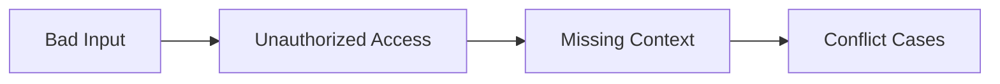

#### NEG-01
- **Test ID:** `NEG-01`
- **Purpose:** Validate login failure handling.
- **Preconditions:** Login page open.
- **Steps:** Enter wrong password and sign in.
- **Input examples:** `admin@example.com` / `wrongpass`.
- **Expected result:** login error displayed, no session created.
- **Failure clues:** user enters protected pages with bad credentials.
- **Recovery action:** investigate auth validation and token issuance.
- **Pass/Fail checklist:**
  - [ ] Pass if login denied with clear error.

#### NEG-02
- **Test ID:** `NEG-02`
- **Purpose:** Validate org slug validation.
- **Preconditions:** Logged in, Tenancy page open.
- **Steps:** Create organization with invalid slug (too short).
- **Input examples:** slug `x`.
- **Expected result:** validation error (`422`) and clear message.
- **Failure clues:** org created with invalid slug.
- **Recovery action:** verify schema validation.
- **Pass/Fail checklist:**
  - [ ] Pass if invalid slug is rejected.

#### NEG-03
- **Test ID:** `NEG-03`
- **Purpose:** Validate missing context protection.
- **Preconditions:** No workspace selected.
- **Steps:** Try create network/add device.
- **Input examples:** click actions directly.
- **Expected result:** warning toast and no resource creation.
- **Failure clues:** action succeeds without context.
- **Recovery action:** inspect client guards and API constraints.
- **Pass/Fail checklist:**
  - [ ] Pass if action is blocked safely.

#### NEG-04
- **Test ID:** `NEG-04`
- **Purpose:** Validate invalid JSON handling in intent/reports.
- **Preconditions:** Intent and Reports pages available.
- **Steps:** Enter broken JSON and submit.
- **Input examples:** `{bad json`.
- **Expected result:** local validation message, request not sent.
- **Failure clues:** silent failure or crash.
- **Recovery action:** confirm input parser and error rendering.
- **Pass/Fail checklist:**
  - [ ] Pass if clear input validation message appears.

#### NEG-05
- **Test ID:** `NEG-05`
- **Purpose:** Validate idempotency conflict behavior.
- **Preconditions:** Existing intent/report request with key already used differently.
- **Steps:** Reuse conflicting idempotency key.
- **Input examples:** same key with changed payload.
- **Expected result:** conflict warning and guidance to use new key.
- **Failure clues:** duplicate processing without warning.
- **Recovery action:** inspect idempotency storage and UI message path.
- **Pass/Fail checklist:**
  - [ ] Pass if conflict is blocked and explained.

---

### 6.6 Accessibility checks

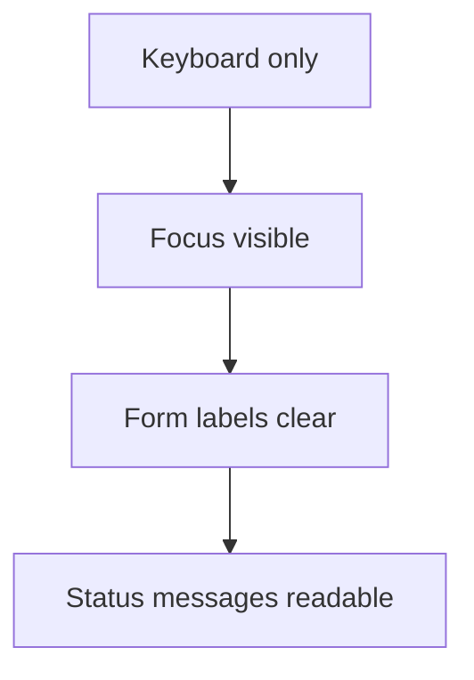

#### A11Y-01
- **Test ID:** `A11Y-01`
- **Purpose:** Keyboard-only navigation check.
- **Preconditions:** App loaded.
- **Steps:** Use Tab/Shift+Tab to move across controls on Login, Tenancy, Intent.
- **Input examples:** keyboard only.
- **Expected result:** all major controls are reachable and usable.
- **Failure clues:** focus traps or unreachable buttons.
- **Recovery action:** fix tab order and focus handling.
- **Pass/Fail checklist:**
  - [ ] Pass if full workflow works without mouse.

#### A11Y-02
- **Test ID:** `A11Y-02`
- **Purpose:** Form label clarity check.
- **Preconditions:** Open form-heavy pages.
- **Steps:** Verify each field has clear label text.
- **Input examples:** Tenancy, Plugins, Reports forms.
- **Expected result:** labels describe required input clearly.
- **Failure clues:** ambiguous or missing label.
- **Recovery action:** add explicit label and helper text.
- **Pass/Fail checklist:**
  - [ ] Pass if fields are self-explanatory.

#### A11Y-03
- **Test ID:** `A11Y-03`
- **Purpose:** Async state readability check.
- **Preconditions:** Trigger loading/error/success states.
- **Steps:** Run one success and one failure action per page sample.
- **Input examples:** invalid login, valid report request.
- **Expected result:** messages are clear and actionable.
- **Failure clues:** generic/unhelpful text.
- **Recovery action:** improve message copy.
- **Pass/Fail checklist:**
  - [ ] Pass if user can understand next step from message alone.

---

### 6.7 Performance and stability checks

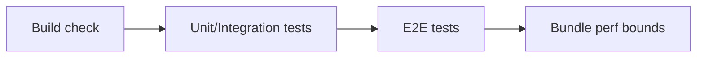

#### PERF-01
- **Test ID:** `PERF-01`
- **Purpose:** Verify backend regression stability.
- **Preconditions:** Backend dependencies installed.
- **Steps:** Run `poetry run pytest tests -q` in `backend/`.
- **Input examples:** none.
- **Expected result:** full suite passes.
- **Failure clues:** repeated failures in same area.
- **Recovery action:** fix failing module, rerun targeted tests, rerun full suite.
- **Pass/Fail checklist:**
  - [ ] Pass if full backend suite passes.

#### PERF-02
- **Test ID:** `PERF-02`
- **Purpose:** Verify frontend test/build stability.
- **Preconditions:** Frontend dependencies installed.
- **Steps:** Run `npm run lint && npm run typecheck && npm run test && npm run test:e2e && npm run build` in `frontend/`.
- **Input examples:** none.
- **Expected result:** all commands pass.
- **Failure clues:** flaky e2e, build errors.
- **Recovery action:** rerun once for transient flake, then debug deterministic issues.
- **Pass/Fail checklist:**
  - [ ] Pass if all frontend gates pass.

#### PERF-03
- **Test ID:** `PERF-03`
- **Purpose:** Verify bundle performance bounds.
- **Preconditions:** Frontend build works.
- **Steps:** Run `npm run perf:bundle`.
- **Input examples:** none.
- **Expected result:** bounded checks true.
- **Failure clues:** threshold exceed warnings.
- **Recovery action:** review chunk sizes and optimize.
- **Pass/Fail checklist:**
  - [ ] Pass if perf bounds remain within expected limits.

---

<a id="section-7"></a>
## 7) Dependency-Driven Master Test Sequence

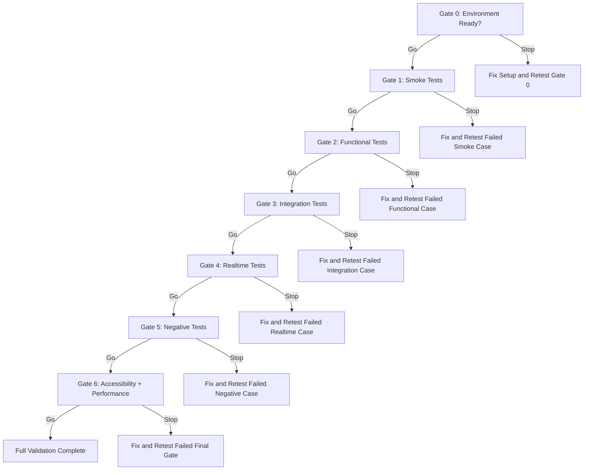

### Master sequence table (strict order)

| Order | Gate | Must pass before next? | Stop rule | Retest loop |
|---|---|---|---|---|
| 0 | Environment and prerequisites | Yes | If any prerequisite missing, stop | Fix setup then rerun Gate 0 |
| 1 | Smoke (`SMK-*`) | Yes | Any fail blocks all later testing | Fix only failed smoke case, rerun smoke |
| 2 | Functional (`FNC-*`) | Yes | Any fail blocks integration | Fix feature, rerun failed case + nearby cases |
| 3 | Integration (`INT-*`) | Yes | Any fail blocks realtime | Fix dependency chain issue, rerun integration block |
| 4 | Realtime (`RT-*`) | Yes | Any fail blocks negative tests | Fix websocket/event issue, rerun realtime block |
| 5 | Negative (`NEG-*`) | Yes | Any fail blocks final readiness | Fix validation/permission path, rerun negative block |
| 6 | Accessibility + performance (`A11Y-*`, `PERF-*`) | Yes | Any fail blocks release readiness | Fix and rerun specific failed check, then full final gate |

### Blocking dependency reminders

- If authentication fails, do not continue.
- If tenancy setup fails, do not continue.
- If network/device setup fails, most feature tests are not valid.
- If websocket baseline fails, realtime conclusions are not valid.

---

<a id="section-8"></a>
## 8) API and Realtime Mapping for Testers (Simple)

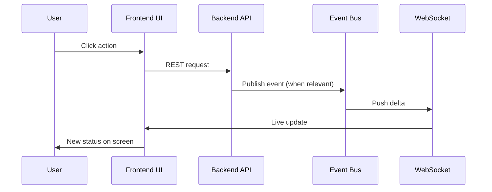

### UI to API and websocket map

| UI journey | When you click X, page calls Y | Realtime channel |
|---|---|---|
| Login | `POST /api/v1/auth/login`, then `GET /api/v1/auth/me` | none required at login moment |
| Create organization | `POST /api/v1/organizations` | none |
| Create workspace | `POST /api/v1/organizations/{org_id}/workspaces` | none |
| Add member | `POST /api/v1/organizations/{org_id}/members` | none |
| Create network | `POST /api/v1/networks` | `/ws/topology` may later reflect structural changes |
| Add device | `POST /api/v1/networks/{network_id}/devices` | `/ws/topology` |
| Edit device spatial ref | `PATCH /api/v1/networks/{network_id}/devices/{device_id}` | `/ws/topology` |
| Open telemetry | `GET /api/v1/telemetry/health`, `GET /api/v1/telemetry/history`, `GET /api/v1/telemetry/device/{id}` | `/ws/telemetry` |
| Open topology analysis | `GET /api/v1/topology/graph`, neighbors, impact, reconcile | `/ws/topology` |
| Start/pause/branch simulation | `/api/v1/simulations/*` | `/ws/digital-twin` |
| Validate/execute intent | `POST /api/v1/intents/validate`, `POST /api/v1/intents/execute`, `GET /api/v1/intents/{id}` | `/ws/digital-twin` |
| Alerts list/ack/resolve | `GET /api/v1/alerts`, `POST /api/v1/alerts/{id}/ack`, `POST /api/v1/alerts/{id}/resolve` | `/ws/alerts` |
| Plugin lifecycle | `GET /api/v1/plugins`, `POST /install`, `POST /enable`, `POST /disable` | none (polling based) |
| Report lifecycle | `POST /api/v1/reports/generate`, `GET /api/v1/reports/{id}` | none (polling based) |

---

<a id="section-9"></a>
## 9) Troubleshooting by Symptom

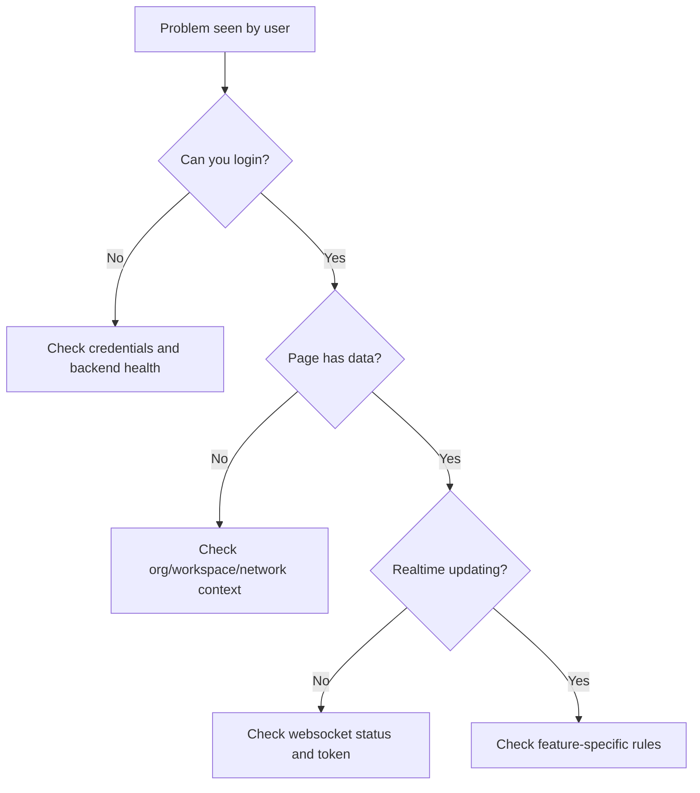

### Symptom table

| Symptom | Most likely causes (ordered) | Quick checks | Deep checks | Fix path | Escalate when |
|---|---|---|---|---|---|
| I cannot log in | Wrong credentials; user not bootstrapped; backend down | Check `/health`; retry known credentials | Check `/api/v1/auth/login` response and backend logs | Recreate bootstrap user; restart backend | Multiple valid users fail login |
| Page is empty | Missing org/workspace/network context; no seed data | Verify selectors in Overview/Tenancy | Check REST response payload in browser network tab | Create/select required parent resources | Data exists in API but UI still empty |
| No telemetry appears | No telemetry ingestion; wrong filter; no device selected | Clear metric filter; select device | Check `/api/v1/telemetry/health` and `/history` | Restore ingestion pipeline and retry | Health endpoint fails repeatedly |
| Simulation never finishes | Simulation state stuck; missing backend transition | Check Simulation detail status | Check simulation service logs and events | Pause/branch/retry with new scenario | Multiple runs stay stuck across retries |
| Intent stuck | Validate passed but execute blocked; permission issue | Check detail status badges and messages | Check execute API response code and idempotency state | Use new idempotency key; verify role/permissions | Repeated `403` for correct role |
| Alert action fails | Alert already resolved; stale row; permission issue | Refresh alerts list and retry | Check `/alerts/{id}/ack|resolve` response code | Perform correct next state action | Many alerts fail with same error pattern |
| Plugin action denied | Signature/dependency/sandbox validation failed | Read plugin safety badges | Check plugin API error code | Correct plugin manifest data | Valid manifest still denied |
| Report not generated | Invalid date/json input; idempotency conflict; backend job failure | Check form validation and status panel | Check report detail and failure diagnostics | Correct input and retry with new key | Repeated terminal failures with valid input |
| Realtime not updating | Websocket not connected; token expired; network context missing | Check WS tiles on Overview | Inspect WS frames/errors (`WS_UNAUTHORIZED`, filter issues) | Re-login, select network, restart backend if needed | All channels fail after restart and clean login |

### Notes for non-blocking noise

- `GET /favicon.ico 404` is usually cosmetic and non-blocking.
- Organization `422` for invalid slug is expected when test input is intentionally bad.

---

<a id="section-10"></a>
## 10) Operations Runbook Lite (For Non-Experts)

| Cadence | What to check | Why this matters | Evidence to keep |
|---|---|---|---|
| Daily | Login works, health endpoint is OK, websocket tiles mostly open | Confirms core service availability | Screenshot of Overview WS tiles + health output |
| Daily | Telemetry and alerts pages load | Confirms monitoring path is alive | One screenshot from Telemetry and Reliability |
| Weekly | Run smoke suite and one integration journey | Catches drift early | Test log with pass/fail and issue list |
| Weekly | Run backend/frontend gate commands | Confirms quality baseline | Command outputs and timestamps |
| Before release | Run full section 6 in strict order | Validates end-to-end readiness | Full test report bundle |
| After change | Rerun impacted functional + integration + realtime tests | Confirms no regressions | Change ticket + retest notes |

### Before-release command checklist

```bash
# backend
cd backend
poetry run ruff check app tests
poetry run pytest tests -q
poetry run python scripts/run_local_flow_check.py --report-path /tmp/opencode/nanfo-flow-report.json

# frontend
cd ../frontend
npm run lint
npm run typecheck
npm run test
npm run test:e2e
npm run build
npm run perf:bundle
```

### Audit evidence checklist

- [ ] Date and environment used.
- [ ] Commands executed.
- [ ] Pass/fail summary per block.
- [ ] Defects found and links.
- [ ] Retest evidence after fixes.

---

<a id="section-11"></a>
## 11) Glossary (Plain English)

| Term | Simple meaning |
|---|---|
| API | A backend endpoint the UI calls to read or change data |
| WebSocket | A live connection used to push updates to the UI |
| Telemetry | Live or historical measurements from devices |
| Topology | A map of devices and how they connect |
| Digital Twin | A visual/live model of network state |
| Simulation | A safe "what-if" test before real changes |
| Intent | A planned action with rules and expected outcome |
| Validate (intent) | Check if the intent is safe and acceptable |
| Execute (intent) | Run the intent workflow |
| Alert | A warning or issue signal |
| Acknowledge | Mark that someone has seen an alert |
| Resolve | Mark that the alert issue is closed |
| Plugin | Add-on capability for the platform |
| Workspace | A scoped working area inside an organization |
| Organization | Top-level tenant boundary for users/resources |
| Tenant boundary | Rule that one org cannot see another org data |
| RBAC | Role-based access control (who can do what) |
| Idempotency key | A unique key to prevent duplicate action side effects |
| Reconcile | Re-check and align data consistency |
| Queue status | Processing state for async work |
| Artifact | Output file from report generation |
| Correlation ID | Request trace id used across services/logs/events |
| Event bus | Internal stream that moves domain events between modules |
| CORS | Browser rule controlling which web origins can call backend |
| UUID | Long unique id string used for records |

---

<a id="section-12"></a>
## 12) Final Readiness Checklist

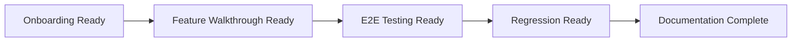

### Printable final checklist

#### A) User onboarding ready
- [ ] Login instructions tested with fresh user.
- [ ] Tenancy setup steps tested from empty state.
- [ ] Common mistakes section reviewed by non-expert.

#### B) Feature walkthrough ready
- [ ] All major pages documented (`overview`, `tenancy`, `topology-analysis`, `telemetry`, `reliability`, `plugins`, `reports`, `digital-twin`, `simulation`, `intent`, `audit`).
- [ ] Every feature has preconditions, steps, expected result, rollback/cancel notes.
- [ ] Screenshot placeholders and callouts exist for each workflow.

#### C) End-to-end testing ready
- [ ] Smoke, functional, integration, realtime, negative, accessibility, and performance blocks are defined.
- [ ] Test blocks are dependency-ordered with stop/go gates.
- [ ] Master sequence includes retest loops.

#### D) Regression ready
- [ ] Backend and frontend command gates are listed and runnable.
- [ ] Known VS21 open risks are documented for test interpretation.
- [ ] Troubleshooting matrix covers key user symptoms.

#### E) Documentation complete
- [ ] Table of contents and section anchors are present.
- [ ] Each major section has a visual element (diagram/table/screenshot placeholder).
- [ ] Language is simple and explicit for non-technical readers.

### Documentation quality gate self-check

| Quality gate | Status |
|---|---|
| Coverage includes delivered VS1-VS20 features plus VS21 context notes | Complete |
| Dependency-ordered and non-ambiguous steps | Complete |
| Non-technical reader can follow | Complete |
| UI instructions include fields/buttons/examples | Complete |
| End-to-end testing sequence is executable | Complete |

---

## Screenshot Capture Pack (to replace placeholders)

Use this exact capture list:

1. Login page with Email, Password, Sign In highlighted.
2. Overview with WS status, org/workspace selectors, Create Network, Add Device.
3. Tenancy with org/workspace/member forms and action buttons.
4. Topology Analysis with device selector, depth/hops, Reconcile, tabs.
5. Telemetry with Health, filter, history, realtime cards.
6. Reliability with status filters and Ack/Resolve actions.
7. Plugins with install form and registry safety badges.
8. Reports with generator form, status badges, artifact rows.
9. Digital Twin with scene, inspector, live deltas.
10. Simulation with lifecycle controls, detail, compare, timeline.
11. Intent with validate/execute form and lifecycle detail.
12. Audit timeline with filter and event rows.

For each screenshot:
- Use callouts `(1)`, `(2)`, `(3)` that match the step text.
- Keep red boxes around clickable controls.
- Use one desktop and one narrow/mobile view for at least Login, Tenancy, Telemetry, and Intent.
